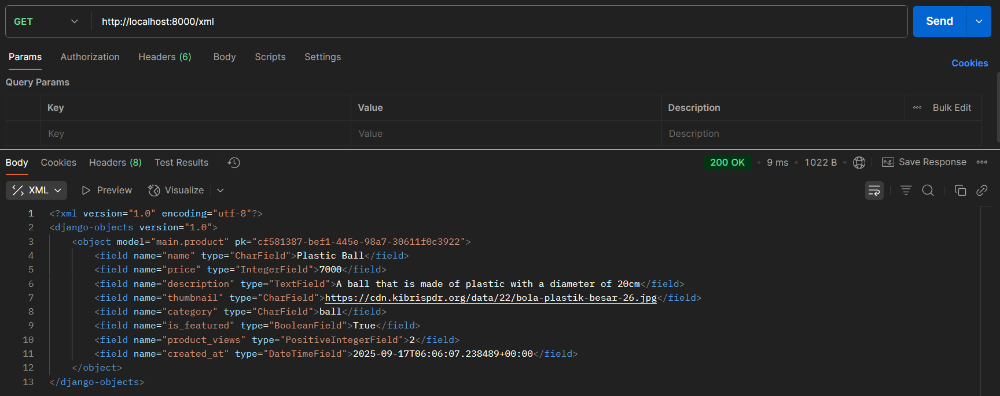
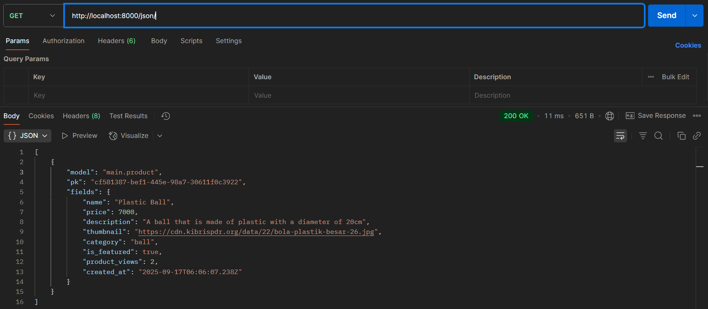
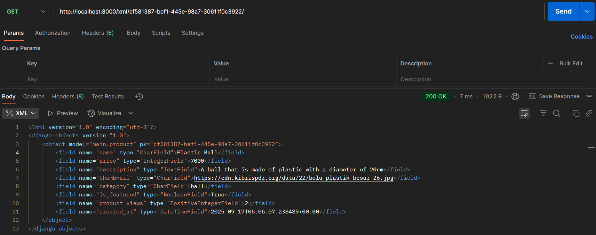
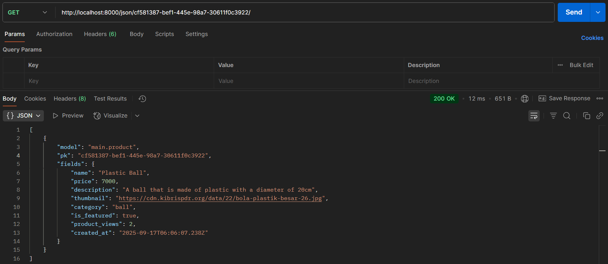

Nama: Raymundo Rafaelito Maryos Von Woloblo
Kelas: PBP B

## Tugas 3
> Data delivery diperlukan untuk memastikan pertukaran data yang efisien, aman, dan skalabel antar komponen platform, seperti server dan klien atau microservices. Tanpa mekanisme ini, integrasi data menjadi tidak terstruktur, rentan terhadap kesalahan, dan sulit diskalakan, sehingga menghambat performa keseluruhan sistem.

> JSON lebih unggul daripada XML untuk sebagian besar aplikasi web modern karena struktur yang lebih sederhana, ukuran file yang lebih kecil, dan kemudahan parsing di bahasa seperti JavaScript. JSON lebih populer karena mendukung efisiensi bandwidth, fleksibilitas dalam API RESTful, dan adopsi luas di framework kontemporer, sedangkan XML lebih sesuai untuk dokumen kompleks dengan skema ketat.

> Method is_valid() pada form Django berfungsi untuk memvalidasi input pengguna berdasarkan aturan yang didefinisikan, mengembalikan True jika valid beserta data yang telah dibersihkan, atau False dengan daftar kesalahan. Method ini esensial untuk mencegah data tidak valid memasuki database, mengurangi kerentanan keamanan, dan menjaga integritas aplikasi tanpa validasi manual yang rumit.

> CSRF token diperlukan untuk mencegah serangan Cross-Site Request Forgery (CSRF), di mana penyerang memanipulasi sesi pengguna yang terautentikasi melalui form palsu. Tanpa token, Django tidak dapat memverifikasi asal request, berpotensi mengizinkan aksi tidak sah seperti transfer dana ilegal. Penyerang dapat mengeksploitasi ini melalui phishing atau situs berbahaya yang menyamar sebagai form legitimate, memanfaatkan cookie sesi untuk eksekusi aksi berbahaya.

> Langkah-langkah mengimplementasikan cheklist tugas 2:
  - Menmbahkan 4 fungsi views baru untuk melihat objek yang sudah ditambahkan dalam format XML, JSON, XML by ID, dan JSON by ID serta membuat routing URL untuk masing-masing fungsi views tadi.
  - Mengimplementasikan skeleton sebagai keranka views
  - Membuat halaman yang menampilkan data objek model yang memiliki tombol "Add" yang akan redirect ke halaman form, serta tombol "Detail" pada setiap data objek model yang akan menampilkan halaman detail objek.
  - Membuat halaman form untuk menambahkan objek model pada app sebelumnya.
  - Membuat halaman yang menampilkan detail dari setiap data objek model.

> Screenshot:
- 
- 
- 
- 

## Tugas 2
> Tautan menuju aplikasi PWS yang sudah di-deploy: https://raymundo-rafaelito-footballshop.pbp.cs.ui.ac.id/

> Langkah-langkah mengimplementasikan cheklist tugas 2:
    - Membuat direktori lokal football-shop 
    - Menyiapkan dependencies dan membuat proyek Django, yaitu football_shop
    - Konfigurasi environment variables dan proyek
    - Unggah proyek ke repositori GitHub
    - Deployment melalui PWS
    - Membuat aplikasi main dalam proyek football-news
    - Membuat dan mengisi berkas main.html
    - Mengubah berkas models.py dalam aplikasi main: Menambahkan Class Product dengan atribut name, price, description, thumbnail, category, is_featured, dan product_views
    - Membuat dan mengaplikasikan migrasi Model
    - Modifikasi template
    - Mengonfigurasi routing URLrAplikasi main
    - Mengonfigurasi routing URL Proyek
    - Membuat Unit Test dan Menjalankan Test

> https://miro.medium.com/v2/resize:fit:1400/1*m2_0pEyl1cfnfWYgCSlAZA.png
  Kaitan antara urls.py, views.py, models.py, dan berkas html pada bagan:
  - HTTP Request: Permintaan HTTP dikirim oleh klien (misalnya browser) ke server.
  - URLs (urls.py): Permintaan diterima oleh modul urls.py yang bertugas untuk memetakan URL ke fungsi atau view yang sesuai, lalu meneruskan permintaan ke view yang tepat.
  - View (views.py): Modul views.py memproses permintaan tersebut. View dapat membaca atau menulis data ke model jika diperlukan.
  - Model (models.py): Model menyediakan data yang dibutuhkan oleh view melalui operasi read/write data.
  - Template (<namafile>.html): View menggunakan template (berupa file HTML) untuk merender data menjadi respons yang dapat ditampilkan.
  - HTTP Response (HTML): Akhirnya, respons dalam bentuk HTML dikirim kembali ke klien sebagai hasil dari permintaan HTTP.

> Berkas settings.py di Django adalah file yang berfungsi sebagai pusat kontrol utama untuk mendefinisikan dan mengonfigurasi berbagai aspek proyek web, mulai dari pengaturan keamanan, seperti kunci rahasia, daftar host yang mempunyai akses, dan penentuan Debug atau tidak; pengaturan koneksi basis data; daftar aplikasi yang terinstal; pengaturan zona waktu dan bahasa; hingga konfigurasi penanganan file statis dan media. File ini bertindak sebagai "cetak biru" yang mengontrol bagaimana aplikasi berfungsi dan memungkinkan penyesuaian berbagai aspek aplikasi sesuai kebutuhan.

> Pertama-tama, dibuat migrasi model yang dijalankan dengan perintah berikut: python manage.py makemigrations

  makemigrations menciptakan berkas migrasi yang berisi perubahan model yang belum diaplikasikan ke dalam basis data. Lalu, diterapkan migrasi ke dalam basis data lokal yang dijalankan perintah berikut: python manage.py migrate

  migrate mengaplikasikan perubahan model yang tercantum dalam berkas migrasi ke basis data dengan menjalankan perintah sebelumnya.

> Jujur, berdasarkan pengetahuan saya sekarang, saya tidak tahu pasti jawabannya, tetapi saya punya hipotesis bahwa jawabannya adalah karena Framework Django merupakan Framework yang paling beginner-friendly

> Belum ada